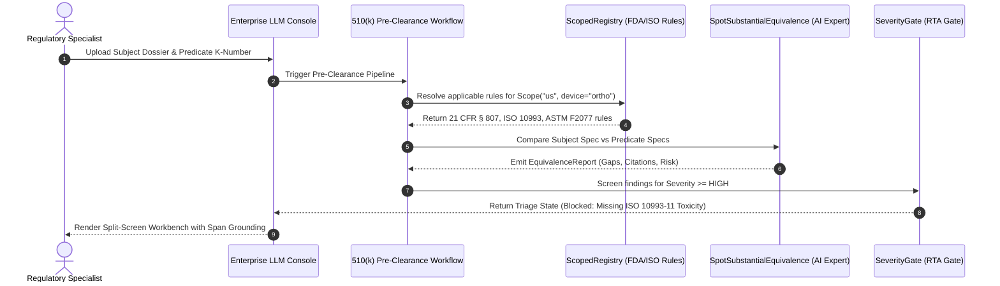

# Deep Dive: MedTech Regulatory Affairs Console

## 1. Executive Summary & Persona Profile
- **Title / Seat:** Director of Regulatory Affairs, Senior Regulatory Writer, MedTech Compliance Specialist.
- **Organization:** Medical Device Manufacturers (Class II & Class III), MedTech Contract Research Organizations (CROs), Regulatory Consultancies.
- **Capital Gravity:** Each regulatory submission governs the commercial release of a medical device expected to generate **$20M to $500M** in revenue.
- **The Financial Cliff:** Over 75% of initial FDA 510(k) premarket notifications receive an **Additional Information (AI)** request or face **Refuse-to-Accept (RTA)** rejection due to missing testing standards, non-equivalent predicate comparisons, or incomplete biocompatibility endpoints. Each deficiency cycle adds **60 to 180 days** of delay, costing sponsors **$10,000 to $50,000 per day** in lost gross margin.

---

## 2. Tech Underexposure & Legacy Tool Trap
- **Why Saturated Tech Overlooked It:** Software vendors treat healthcare as either clinical documentation (ambient scribes for doctors) or generic life sciences SaaS. MedTech RA requires a hybrid understanding of electrical/mechanical engineering specs, biocompatibility toxicology, and administrative case law.
- **Current Archaic Toolchain:** 
  - **Veeva Vault / MasterControl:** Used purely as static cloud file lockers (document version control), offering zero cognitive cross-referencing between files.
  - **Adobe Acrobat Pro:** Manual PDF highlighting across 500-page engineering test reports.
  - **Microsoft Word Track Changes:** Regulatory writers manually paste excerpts into 510(k) templates.
  - **CDRH Web Search:** Hunting through FDA guidance documents and 20-year-old 510(k) clearance summaries.

---

## 3. Cognitive Friction & Daily Bottlenecks

1. **Substantial Equivalence (SE) Comparison:**
   - Under 21 CFR § 807.87(f), the sponsor must prove their subject device is as safe and effective as a legally marketed "predicate device".
   - The specialist must compare materials (e.g., Titanium Ti-6Al-4V vs. PEEK-OPTIMA), design dimensions, energy sources, sterilization methods, and clinical indications for use.
   - Any difference in technological characteristics requires providing performance data proving it does not raise new questions of safety and effectiveness.

2. **FDA Refuse-to-Accept (RTA) Checklist Auditing:**
   - The FDA applies a rigid 54-item checklist within the first 15 calendar days of receiving a 510(k).
   - If a single required element (e.g., pyrogenicity testing method under FDA Guidance 2024, shelf-life sterility validation per ISO 11135) is missing, the submission is rejected without scientific review.

3. **Standards Harmonization (ISO 10993, ISO 14971, IEC 60601):**
   - The specialist must verify that every cited standard in the lab reports corresponds to the FDA-recognized consensus standard edition currently in effect.

---

## 4. Console Architecture: Layer-by-Layer Implementation in `pipe`



### Layer 1: Scoped Rules Catalog (`catalog.py`)
```python
from pipe.lib.detectors import Rule
from pipe.lib.shared import Scope, ScopedRegistry, Severity

RULES: ScopedRegistry[Rule] = ScopedRegistry()

# Universal Consensus Standards
RULES.add(Scope.of(), Rule("std.iso10993", r"\bISO\s*10993(?:-\d+)?\b", Severity.HIGH))
RULES.add(Scope.of(), Rule("std.iec60601", r"\bIEC\s*60601(?:-\d+)?\b", Severity.HIGH))

# US FDA Jurisdiction
RULES.add(Scope.of("us"), Rule("fda.k_number", r"\bK\d{6}\b", Severity.INFO))
RULES.add(Scope.of("us"), Rule("fda.cfr807", r"\b21\s*C\.?F\.?R\.?\s*§?\s*807\b", Severity.HIGH))

# Domain Facet: Orthopedic Implants
RULES.add(Scope.of("us", domain="ortho"), Rule("req.fatigue_testing", r"\bASTM\s*F2077\b", Severity.CRITICAL))
```

### Layer 2: Typed AI Expert (`operations.py`)
```python
from pydantic import BaseModel
from pipe.lib.experts.ai import AIBasedExpert
from pipe.lib.shared import Prediction, Severity

class EquivalenceGap(BaseModel):
    category: str
    subject_value: str
    predicate_value: str
    severity: Severity
    gap_summary: str
    statutory_citation: str
    recommended_action: str

class SubstantialEquivalenceReport(BaseModel):
    subject_device: str
    predicate_device: str
    is_substantially_equivalent: bool
    gaps: list[EquivalenceGap]

class SpotSubstantialEquivalence(AIBasedExpert[Prediction, SubstantialEquivalenceReport]):
    specification = (
        "You are an FDA CDRH Lead Regulatory Reviewer. Compare the subject device dossier "
        "against the predicate device clearance summary. Identify every technological difference, "
        "indication divergence, or missing performance testing standard."
    )
    request_json = True
```

### Layer 4: Pipeline Assembly (`workflow.py`)
```python
from pipe.lib.experts.workflow import Workflow
from pipe.lib.experts.generic import Redactor, Annotator, SeverityGate
from pipe.lib.experts.legal.operations import DetectPII

pre_clearance_pipeline = (
    DetectPII(jurisdiction="us")
    >> Redactor(name="redact_patient_and_confidential_data")
    >> SpotSubstantialEquivalence(name="substantial_equivalence_engine")
    >> Annotator(key="regulatory_audit_meta")
    >> SeverityGate(threshold=Severity.HIGH, key="blocks_fda_submission")
)
```

---

## 5. Console UI / UX: The Split-Pane Grounding Workbench

```
┌────────────────────────────────────────────────────────────────────────────────────────┐
│  MEDTECH REGULATORY CONSOLE (PIPE-ENGINE)                      Matter: OrthoSpine-K26   │
├──────────────────────────────────────────┬─────────────────────────────────────────────┤
│  SOURCE DOSSIER (PDF / AST)              │  510(k) SUBSTANTIAL EQUIVALENCE COCKPIT     │
│  [Section 12: Biocompatibility.pdf]      │                                             │
│                                          │  Subject Device: PEEK Lumbar Cage           │
│  Line 142: "The subject device was       │  Predicate Device: Medtronic K192451        │
│  evaluated for cytotoxicity per          │                                             │
│  ISO 10993-5 (MEM Elution Assay)         │  CRITICAL GAPS (SeverityGate: HIGH)         │
│  showing no cytotoxic effect.            │  ────────────────────────────────────────── │
│  Sensitization testing per               │  [!] ISO 10993-11 Systemic Toxicity Missing │
│  ISO 10993-10 was conducted..."          │      Predicate was tested up to 14 days.    │
│                                          │      Subject file contains no evidence.     │
│                                          │      [Action: Draft Testing Requirement]    │
│                                          │                                             │
│                                          │  RTA STATUTORY CHECKLIST (FDA CDRH)         │
│                                          │  ────────────────────────────────────────── │
│                                          │  [✓] 21 CFR 807.87(a) Device Name & Class   │
│                                          │  [✓] 21 CFR 807.87(f) Indications for Use   │
│                                          │  [✗] Section 12.4: Pyrogenicity Assessment  │
│                                          │      Rule: FDA Guidance 2024-Ortho-03       │
│                                          │      [Remedy with Atomic Prompt] [Ignore]   │
├──────────────────────────────────────────┴─────────────────────────────────────────────┤
│  STATUS: Flagged for Review (2 High Gaps, 0 PII leaks, Jurisdiction: US/FDA/CDRH)      │
└────────────────────────────────────────────────────────────────────────────────────────┘
```

---

## 6. Commercial Unit Economics & GTM Wedge
- **Console Pricing:** $50,000 to $120,000 per enterprise license annually (includes 5 regulatory specialist seats).
- **Payback Period:** < 1 month. Preventing a single 90-day FDA Additional Information delay saves the device sponsor upwards of **$1,000,000** in delayed commercial cash flows.
- **Initial Target Customer:** 
  1. Mid-market orthopedic, cardiovascular, and diagnostic device manufacturers with active 510(k) pipelines.
  2. MedTech Contract Research Organizations (CROs) and regulatory advisory firms (e.g., Emergo by UL, MCRA, NAMSA).
