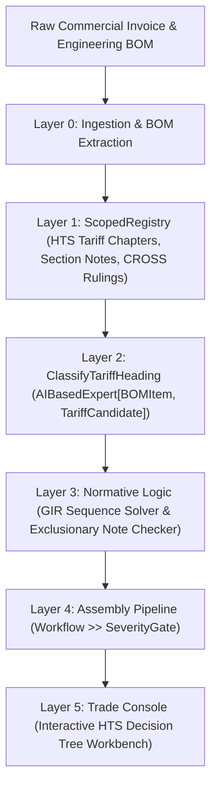

# Deep Dive: Global Trade & Customs Compliance Console

## 1. Executive Summary & Persona Profile
- **Title / Seat:** Licensed Customs Broker (LCB), Director of Global Trade Compliance, Customs Import Specialist.
- **Organization:** Fortune 500 Importers, Global Freight Forwarders, Customs Brokerage Houses.
- **Capital Gravity:** A single trade compliance officer oversees import entry filings for **$50M to $1B** in goods annually.
- **The Financial Cliff:** 
  - Misclassifying an imported product can lead to millions in unpaid duties, retroactive antidumping/countervailing duties (AD/CVD) of up to 250%, and 19 U.S.C. § 1592 civil penalties reaching **300% of the declared value** for gross negligence.
  - Border seizures and Customs and Border Protection (CBP) Holds freeze entire automotive or electronics manufacturing lines, incurring demurrage and factory stoppage costs of **$100,000+ per day**.

---

## 2. Tech Underexposure & Legacy Tool Trap
- **Why Saturated Tech Overlooked It:** Trade compliance requires bridging the physical world (material chemistry, engineering schematics, power ratings) with arcane legal interpretations.
- **Current Archaic Toolchain:** 
  - **CargoWise / Descartes:** Transactional EDI pipes built in the early 2000s that transmit electronic entry summaries (CBP Form 7501) but offer zero AI assistance for tariff determination.
  - **USITC / TARIC Web Search:** Manually scrolling through 99 chapters of the Harmonized Tariff Schedule.
  - **CBP CROSS Search:** Searching through decades of unstructured Customs Rulings text.
  - **Excel Bills of Materials:** 5,000-line multi-tab spreadsheets filled with cryptic engineering part numbers.

---

## 3. Cognitive Friction & Daily Bottlenecks

1. **10-Digit HTS Classification via GIRs:**
   - Classification must follow the **6 General Rules of Interpretation (GIRs)** in strict sequence.
   - For example, GIR 1 classifies based on Chapter Notes; GIR 3(b) classifies composite goods by "essential character"; GIR 6 governs subheading level classification.
   - A lithium-ion powered electric scooter could be classified under 8711 (motorcycle), 8716 (trailer/other vehicle), or 9503 (wheeled toy) depending on motor wattage and wheel diameter.

2. **Section and Chapter Legal Notes:**
   - Chapter Notes are statutory exclusions (e.g., "This chapter does not cover parts of general use as defined in Note 2 to Section XV").
   - Missing a single exclusionary footnote causes misclassification.

3. **Rules of Origin & Free Trade Agreements (USMCA):**
   - Verifying whether an assembly qualifies for duty-free preferential treatment requires calculating Regional Value Content (RVC) or tracing "tariff shift" criteria through every component in the Bill of Materials.

---

## 4. Console Architecture: Layer-by-Layer Implementation in `pipe`



### Layer 1: Scoped Rules Catalog (`catalog.py`)
```python
from pipe.lib.detectors import Rule
from pipe.lib.shared import Scope, ScopedRegistry, Severity

RULES: ScopedRegistry[Rule] = ScopedRegistry()

# Universal Harmonized System (6-digit international WCO base)
RULES.add(Scope.of(), Rule("hs.heading", r"\b\d{4}\.\d{2}\b", Severity.INFO))

# US Jurisdiction: 10-digit HTSUS
RULES.add(Scope.of("us"), Rule("htsus.code", r"\b\d{4}\.\d{2}\.\d{4}\b", Severity.INFO))
RULES.add(Scope.of("us"), Rule("trade.ad_cvd_flag", r"\bAD/CVD\s*Order\b", Severity.CRITICAL))

# Country-Specific Free Trade Agreement Scope
RULES.add(Scope.of("us", fta="usmca"), Rule("rule.tariff_shift", r"\bCC|CTH|CTSH\b", Severity.HIGH))
```

### Layer 2: Typed AI Expert (`operations.py`)
```python
from pydantic import BaseModel
from pipe.lib.experts.ai import AIBasedExpert
from pipe.lib.shared import Prediction, Severity

class HTSCandidate(BaseModel):
    hts_code: str
    description: str
    gir_justification: str
    duty_rate_percent: float
    confidence_score: float
    applicable_section_notes: list[str]
    ad_cvd_risk: bool

class TariffClassificationReport(BaseModel):
    item_part_number: str
    primary_candidate: HTSCandidate
    alternative_candidates: list[HTSCandidate]
    requires_cross_ruling: bool
    risk_severity: Severity

class ClassifyTariffHeading(AIBasedExpert[Prediction, TariffClassificationReport]):
    specification = (
        "You are a licensed US Customs Broker. Classify the engineering BOM item into the correct "
        "10-digit HTSUS code following General Rules of Interpretation (GIR) 1 through 6 in sequence. "
        "Explicitly justify why competitor headings were excluded using Chapter Notes."
    )
    request_json = True
```

---

## 5. Console UI / UX: The HTS Decision Tree Cockpit

```
┌────────────────────────────────────────────────────────────────────────────────────────┐
│  TRADE COMPLIANCE CONSOLE (PIPE-ENGINE)                       Entry: INV-2026-9042     │
├──────────────────────────────────────────┬─────────────────────────────────────────────┤
│  ENGINEERING BOM / COMMERCIAL INVOICE    │  HTS CLASSIFICATION WORKBENCH               │
│  [Part: Brushless DC Motor Assy #441]    │                                             │
│                                          │  RECOMMENDED CODE: 8501.31.8000             │
│  Description: 48V 600W Brushless Motor   │  Duty Rate: 2.8% (General)                  │
│  with Integrated Planetary Gearbox       │                                             │
│  Weight: 2.4 kg                          │  GIR JUSTIFICATION AUDIT TRAIL              │
│  Intended Use: Electric Scooter Hub      │  ────────────────────────────────────────── │
│                                          │  [✓] GIR 1: Heading 8501 covers electric    │
│  Line 18: "Output rated at 600W,         │      motors. Gearbox does not alter the     │
│  direct drive planetary gear..."         │      essential character per Section XVI    │
│                                          │      Note 3.                                │
│                                          │                                             │
│                                          │  EXCLUSION ANALYSIS                         │
│                                          │  ────────────────────────────────────────── │
│                                          │  [✗] Heading 8714 (Scooter parts) REJECTED: │
│                                          │      Section XVII Note 2(e) specifically    │
│                                          │      excludes electric motors of 8501.      │
├──────────────────────────────────────────┴─────────────────────────────────────────────┤
│  STATUS: Approved (Audit Trail Verified, Zero AD/CVD Risk, Saved to 7501 Form)        │
└────────────────────────────────────────────────────────────────────────────────────────┘
```
