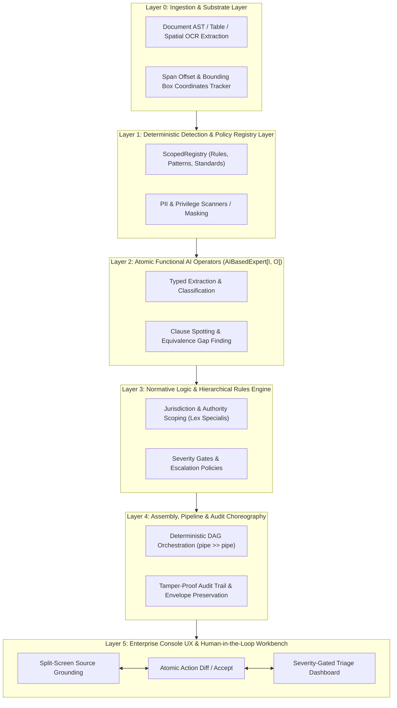

# Master Strategic Report: Building the Enterprise LLM Console for Underexploited Professions

## 1. Executive Summary: The "Invisible Leverage" Economy

The first wave of enterprise generative AI products has heavily saturated low-consequence domains: code autocompletion (Cursor, GitHub Copilot), marketing copywriting (Jasper, Copy.ai), generic sales outreach (Apollo, Clay), and basic non-disclosure agreement summarization. 

These products rely on a **conversational, probabilistic chat interface**. In such environments, hallucinations, missed nuances, or omitted footnotes are acceptable inconveniences.

However, in high-stakes enterprise governance, that conversational paradigm breaks down entirely. There is an entire tier of professionals who operate in the **"Invisible Leverage" economy**:
1. **Low Aggregate Headcount, Astronomical Capital Gravity:** Although their absolute population is relatively small (tens of thousands rather than millions), each professional governs **$10M to $1B** in capital, regulatory clearance, or financial exposure annually.
2. **The "Boring / Arcane" Protective Moat:** Their day-to-day work is saturated with statutory footnotes, standardized coding hierarchies, and administrative procedures. Horizontal AI companies ignore them because their product managers cannot understand the terminology.
3. **Catastrophic Asymmetry of Risk:** A single miscited statute, missed flow-down clause, or overlooked material difference in a technical dossier results in regulatory rejections, multimillion-dollar customs penalties, or catastrophic insurance coverage leaks.
4. **The Archaic Tooling Trap:** Because mainstream software vendors ignore them, their daily workflow is trapped in Adobe Acrobat, 50-tab Excel spreadsheets, legacy Windows XP-era enterprise software, or green-screen terminal emulators.

---

## 2. Layer-by-Layer Architectural Decomposition

To construct an enterprise LLM console that professionals trust, we must reject the monolithic "system prompt + chat box" model. Instead, we decompose expert cognitive work into **five discrete, hierarchical layers**, separating **general horizontal capabilities** from **specific domain implementations**.



### Layer 0: Ingestion & Substrate Layer (Perceptual & Spatial Grounding)
- **General Case:** 
  - Converts complex unstructured files (PDF, DOCX, XLSX, scans, multi-page TIFFs) into structural Abstract Syntax Trees (ASTs).
  - Preserves exact bounding-box coordinates, page indexes, and character offsets (`Span(start, end)`).
  - Extracts multi-page tabular grids without flattening hierarchical headers.
- **Specific Cases:**
  - *MedTech RA:* Ingestion of FDA eCTD 5-module structures, medical device engineering drawings, test laboratory certificates (ISO/IEC 17025), and IFU (Instructions for Use) leaflets.
  - *Trade Compliance:* Parsing commercial invoices, packing lists, Bills of Lading, and multi-currency engineering Bills of Materials (BOMs).
  - *GovCon:* Deconstructing Section L (Instructions to Offerors) and Section M (Evaluation Factors) in DoD solicitations.

### Layer 1: Deterministic Detection & Policy Registry Layer (Zero-Stochasticity Guardrails)
- **General Case:**
  - Non-LLM deterministic rules engine running in microseconds.
  - PII masking (`pii.email`, `pii.ssn`, `pii.phone`, `pii.bank_account`).
  - Scoped hierarchy management via `ScopedRegistry` where rules are tagged with territorial jurisdiction (`Scope.of("us")`, `Scope.of("us/ny")`) or domain facets.
  - Redaction transforms (`Redactor`) that modify text spans right-to-left to preserve offset fidelity.
- **Specific Cases:**
  - *MedTech RA:* Spotting statutory citations (21 CFR Part 820, 21 CFR § 807.87, EU 2017/745), biocompatibility test codes (ISO 10993-5 cytotoxicity, ISO 10993-10 irritation), device clearance numbers (510(k) "K-numbers", PMA "P-numbers").
  - *Trade Compliance:* HTS code pattern matchers (`####.##.####`), Incoterms (FOB, CIF, DDP), Export Control Classification Numbers (ECCNs, e.g., `3A001`, `5A002`), Sanctioned Entity list identifiers.
  - *GovCon:* FAR citation regexes (`FAR 52.2##-##`), CAGE codes, Unique Entity Identifiers (UEI), Buy American Act (BAA) statutory triggers.

### Layer 2: Atomic Functional AI Operators (`Expert[I, O]`)
- **General Case:**
  - Strongly typed, prompt-driven operators deriving from `AIBasedExpert[I, O]`.
  - Input `I` and Output `O` are reified Pydantic models with strict JSON schema validation.
  - Performs single, atomic cognitive acts:
    - Text classification into discrete enums.
    - Structured entity extraction with justification.
    - Semantic gap analysis between two text spans.
    - Automated drafting of standardized correspondence.
- **Specific Cases:**
  - *MedTech RA:*
    - `SpotSubstantialEquivalence`: Compares subject device vs. predicate device on indications for use, technological characteristics, and performance data. Emits `EquivalenceMatrix`.
    - `AuditRTAChecklist`: Evaluates whether a technical section satisfies FDA's 54 Refuse-to-Accept statutory criteria.
    - `VerifySterilizationProtocol`: Verifies validation data against ANSI/AAMI/ISO 11135 (EtO) or 11137 (Radiation).
  - *Trade Compliance:*
    - `ClassifyTariffHeading`: Determines the 4-digit heading using General Interpretative Rule 1 (GIR 1), justifying against chapter/heading explanatory notes.
    - `EvaluateRuleOfOrigin`: Determines if regional value content (RVC) or tariff-shift criteria under USMCA Annex 4-B are met.

### Layer 3: Normative Logic & Hierarchical Rules Engine
- **General Case:**
  - Decides which rules and standards take precedence using statutory doctrines:
    - *Lex Specialis Derogat Legi Generali:* Specific rules override general rules.
    - *Hierarchy of Authority:* Federal/International treaties override state/local regulations; binding statutes override non-binding administrative guidance.
  - Evaluates deterministic thresholds using severity gates (`SeverityGate`).
- **Specific Cases:**
  - *MedTech RA:* Resolves conflicts between general FDA guidances and device-specific Special Controls (e.g., FDA guidance for orthopedic bone screws overrides generic titanium implant guidelines). Enforces that an FDA Refuse-to-Accept deficiency triggers an immediate `Severity.CRITICAL` block.
  - *Trade Compliance:* Resolves Section 301 China tariff exclusions, antidumping/countervailing duty (AD/CVD) scopes, and binding CBP classification rulings (CROSS) that supersede generic HTS chapter notes.

### Layer 4: Assembly, Pipeline & Audit Choreography (`Workflow`)
- **General Case:**
  - Composition of atomic operators into Directed Acyclic Graphs (DAGs) using the pipeline operator (`>>`).
  - Immutable envelope pattern (`Prediction` / `Envelope`) where metadata, detections, severity ratings, and transformation logs are carried forward without loss.
  - Checkpointing and replayability: every intermediate state can be inspected, rolled back, or verified by an external auditor.
- **Specific Cases:**
  - *MedTech RA 510(k) Pre-Clearance Workflow:*
    `DetectPII >> Redact >> ParseSections >> SpotPredicates >> ExtractSpecs >> CompareWithPredicate >> AuditRTAChecklist >> SeverityGate`
  - *Customs Entry Screening Workflow:*
    `ParseCommercialInvoice >> SpotSanctions >> ResolveHTSCandidate >> VerifyCountryOfOrigin >> CalculateDutyLiability >> FlagADCVD`

### Layer 5: Enterprise LLM Console UX Layer (The Professional Cockpit)
- **General Case:**
  - **No Naked Chat Window:** The primary interface is a split-screen workbench.
  - **Bi-directional Grounding:** Clicking any AI-suggested determination immediately highlights the corresponding span/page in the source document.
  - **Atomic Review & Redlining:** The user does not "re-prompt"; they accept, reject, or modify specific atomic findings.
  - **Audit Export:** One-click generation of fully cited audit memos, formatted in official agency or corporate templates.
- **Specific Cases:**
  - *MedTech RA Console:* Side-by-side comparison matrix (Subject Device vs. Predicate Device); FDA RTA Readiness Scorecard with traffic-light indicators; interactive deficiency resolution drawer.
  - *Trade Compliance Console:* Interactive HTS decision tree explorer showing why heading 8471 won over 8517; customs clearance risk score; duty minimization advisor.

---

## 3. Systematic Evaluation Matrix: Selecting the First Point of Call

| Dimension | [1] MedTech Reg Affairs | [2] Customs & Trade | [3] GovCon Procurement | [4] Reinsurance Underwriting | [5] Forensic Accounting | [6] ESG Compliance |
| :--- | :---: | :---: | :---: | :---: | :---: | :---: |
| **ACV & Willingness to Pay** | 5 | 4 | 5 | 5 | 4 | 3 |
| **Cost of Inaction / Delay** | 5 ($50k/day) | 4 (Port holds) | 5 (Bid loss) | 4 (Unpriced risk) | 3 (Billing time) | 2 (Fines distant) |
| **Framework Standardization** | 5 (FDA/ISO/EU) | 5 (WCO HTS / USITC) | 4 (FAR/DFARS) | 2 (Custom slips) | 2 (Ad-hoc ledgers)| 3 (Volatile) |
| **Fit with `pipe` Architecture** | 5 | 5 | 4 | 3 | 3 | 4 |
| **Incumbent Moat Vulnerability**| 5 (Veeva is dumb DMS) | 5 (Green screens) | 4 (Deltek/SAM) | 4 (Guidewire) | 3 (Excel/Relativity)| 4 (Spreadsheets) |
| **Total Score** | **25 / 25** | **23 / 25** | **22 / 25** | **18 / 25** | **15 / 25** | **16 / 25** |

### The Verdict: MedTech Regulatory Affairs is the #1 Beachhead
1. **Asymmetric ROI:** Eliminating a single 90-day FDA deficiency cycle saves a medical device sponsor between **$500,000 and $2,000,000**.
2. **Deterministic & Objective Standards:** The FDA literally publishes the "510(k) Substantial Equivalence Decision-Making Process", standard RTA checklists, and product codes (ProCodes).
3. **Direct Code Fit:** Reuses the existing functional framework (`Expert`, `ScopedRegistry`, `SeverityGate`, `Workflow`) with zero core rewrites.

---

## 4. The 3-Wave Strategic Product Roadmap

```
WAVE 1: IMMEDIATE WEDGES (Tier 1)      WAVE 2: ENTERPRISE EXPANDERS (Tier 2)     WAVE 3: HYBRID MOATS (Tier 3)
Pure document / strict statutory rules   Multi-system audit & cross-reconciliation   Spatial / sensor / physical data
├── 1. MedTech Reg Affairs (FDA 510k)  ├── 5. Clinical Trial TMF Auditing        ├── 10. Construction Delay Claims
├── 2. Customs Brokerage (10-Digit HTS) ├── 6. Hospital Inpatient Appeals        ├── 11. NEPA Environmental Permitting
├── 3. GovCon (FAR/DFARS Flow-Downs)   ├── 7. Aviation MRO Part Tracking         └── 12. FERC Grid Interconnection
└── 4. Reinsurance Treaty Slips        ├── 8. Transfer Pricing & State Tax
                                       └── 9. ESG / CSRD Assurance Trails
```
